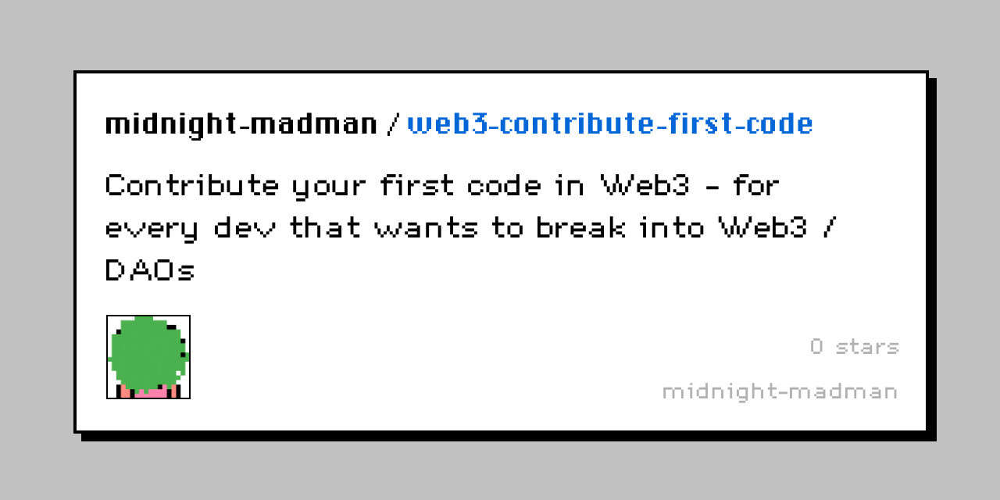

# 🔮 Intro

### tl;dr: go straight to the content


[projects.md](projects.md)


### Welcome

Welcome to Web3 Contribute First Code - a curated list of web3 projects that are open for contributions.

This is an open list of projects that have tagged issues as "good first issue", "open for contribution" or similar.

This is not a guideline or roadmap how to become a web3 developer.

## 🚀 What's next

In the future we can rate projects on how well they onboard new developers, advise DAOs that want to open their code to newcomers, etc.
